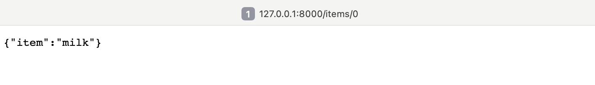

###### These are the notes I made while studying how to use FastAPI by following this short video:https://youtu.be/iWS9ogMPOI0?si=NVdPOg_mrEpdu9I0

   from fastapi import FastAPI
    app=FastAPI()
    @app.get('/')
    def root():
      return {"Hello":"World"}

on the terminal
    pip install fastapi
    pip install uvicorn
    uvicorn main:app --reload

This will run a basic app

To re-run after making changes, simply save the file and it will reload the server automatically. 

Uvicorn works with files ending with .py only. 

Uvicorn is used because FastAPI requires ASGI (Asynchronous Server Gateway Interface) to handle requests and serve the application

**Asynchronous Server Gateway Interface (ASGI)** facilitates asynchronous communication because web servers and our Python web appplications, enabling support for high concurrency and real-time protocols. ASGI supports both HTTP and web sockets. ASGI is typically callable with 3 parameters, they are: scope (connection details), receive ( read client messages) and send (server response). 

concurrency = performing multiple tasks simultaneously. 

We create routes to handle different interactions. 

We create a new endpoint for our app.

    @app.post("/items")
    def create_item(item: str):
      items.append("items": items)
      return items

To add an item to the list, we can use curl and add the parameter at the end of the URL of the app like this:

curl -X POST -H "Content-Type: application/json" 'http://127.0.0.1:8000/items?item=milk'

To view a particular item on the list we create a new end-point.

    @app.get("/items/{item_id}")
    def get_item(item_id:int) -> str:
      return {"item": items[item_id]}

** Make sure to type /items/0 at the end of the url to view the first item. **

Every time we make a change, the server will reload and the items in the array will be erased.

We can use HTTP extension to display errors

from fastapi import FastAPI

app = FastAPI()
items = []

@app.post("/items")
def create_item(item: str):
    items.append(item)
    return {"items": items}

@app.get("/")
def root():
    return {"message": "Welcome! Try /items or /items/{id}"}

@app.get("/items/{item_id}")
def get_item(item_id: int):
    if 0 <= item_id < len(items):
        return {"item": items[item_id]}
    return {"error": "Item not found"}

If FastAPI says "detail":"Not Found" because no endpoint exists there.

#### Pydantic
A base model is the starting point for a Pydantic model. A pydantic model has strict validation rules and all pydantic models inherit their essentail behavior from the base model.   
Pydantic models are used to define schemas for structured data.   
You write your data requirements as annotated fields in a class. Pydantic ensures that the incoming data matches your requirements and notifies you of errors.  
Strict mode or Pedantic model does not aloow coercion, data must exactly fit the required data type.

    from pydantic import BaseModel

    class Item(BaseModel):
      text : str = None
      is_done bool = False

    @app.get("/items):
    def list_items(limit : int =10):
    return items[0:limit]

To add the item, we cannot use the same curl request, we need to add the item in the JSON payload of the request.

   curl -X POST -H "Content-Type: application/json" -d '{"text":"apple"}' 'http://127.0.0.1:8000/items'

is_done will output False because we have given false as the default value. For it to output True, we will have to pass is_done=True.

We can add *response model* to structure the response. 

    @app.get("/items/{item_id}", response_model = Item)
    def get_item(item_id:int):
      return items[item_id]

We can go to our local fast API server and add docs/ or redoc at the end of the url to view all our endpoints and which http methods they accept, and the type of parameters they take. 

#### Code-

from fastapi import FastAPI
from pydantic import BaseModel

app = FastAPI()
items = []

class Item(BaseModel):
    text: str | None = None   # item text (optional)
    is_done: bool = False     # status (default False)

@app.post("/items")
def create_item(item: Item):
    items.append(item.dict())
    return {"items": items}

@app.get("/") #items will be displayed in the root url itself 
def root():
    return {"items": items} # Here, we have explicitly told FastAPI that the items should be displayed in the root.

from fastapi import HTTPException

@app.get("/items/{item_id}", response_model=Item)
def get_item(item_id: int):
    if item_id < 0 or item_id >= len(items):
        raise HTTPException(status_code=404, detail="Item not found")
    return items[item_id]

##### Bash-

div@Divyas-MacBook-Air PERSONAL_CODES % curl -X POST -H "Content-Type: application/json" -d '{"text":"apple"}' 'http://127.0.0.1:8000/items'
{"items":[{"text":"apple","is_done":false}]}%                                                                                                                                                               div@Divyas-MacBook-Air PERSONAL_CODES %  curl -X POST -H "Content-Type: application/json" -d '{"text":"cherries"}' 'http://127.0.0.1:8000/items'
{"items":[{"text":"apple","is_done":false},{"text":"cherries","is_done":false}]}%        

